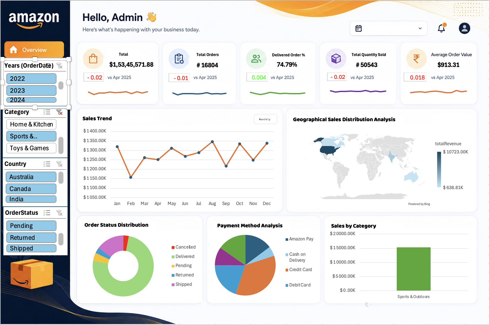

# Amazon-Sales
It is a sales analysis dashboard completely craved out on MS Excel
# Amazon E-Commerce Transaction Analytics Dashboard

An end-to-end, dynamic business intelligence dashboard engineered entirely from scratch in Excel. This project transforms a massive dataset of raw, unorganized Amazon e-commerce transactions into a scalable, production-grade tool designed to uncover consumer behavior and optimize supply chain dynamics.

This dashboard focuses heavily on backend data manipulation, custom calculated KPI tracking, and a modern, high-fidelity UI/UX layout optimized for executive decision-making.

---

## 🚀 Core Features & Architecture

*   **Dynamic KPI Engine:** Engineered custom calculated fields within the Pivot Table architecture to compute live operational and financial health metrics, including:
    *   **Total Revenue:** Tracked in local currency (`₹1.53Cr+`).
    *   **Operational Volume:** Monitoring `Total Orders` and `Total Quantity Sold`.
    *   **Delivery Success Rate:** A custom performance matrix evaluating the exact fulfillment efficiency (`74.79%`).
    *   **Average Order Value (AOV):** Automatically tracking transaction size changes over time.
    *   **Period Comparisons:** Features automated baseline shifting (`vs Apr 2025`) and minimalist sparklines embedded directly within each metric block to visualize immediate trends.
*   **Multi-Dimensional Data Slicers:** Implemented a unified filtering panel allowing stakeholders to drill deep into specific market segments instantly across four major facets:
    *   **Temporal:** Year (2022 - 2024)
    *   **Product Hierarchy:** Home & Kitchen, Sports & Outdoors, Toys & Games
    *   **Geography:** Global operations including India, Australia, and Canada
    *   **Logistics Status:** Pending, Shipped, Returned, and Cancelled
*   **Advanced Visualizations & Layout:** Separated backend analytical logic from the presentation layer to produce clean, non-standard Excel visualizations, including geographical distribution mapping, order status donut charts, and payment method share breakdowns.

---

## 📊 Visual Insights & Analytical Breakdown

1.  **Fulfillment & Logistics Health:** The *Order Status Distribution* donut chart allows managers to quickly audit operational friction by isolating the delta between pending, returned, or cancelled orders relative to successfully delivered ones.
2.  **Global Revenue Distribution:** The integrated *Geographical Sales Distribution Analysis* maps transaction density, instantly showing market dominance across distinct international borders.
3.  **Consumer Preference Trends:** The *Payment Method Analysis* pie chart decodes purchasing friction by breaking down transaction methods across Amazon Pay, Cash on Delivery, and Credit/Debit cards to optimize payment gateway partnerships.

---

## 🛠️ Tech Stack & Analytical Skills

*   **Platform:** Microsoft Excel
*   **Data Engineering:** Raw transaction cleaning, data type alignment, manipulation of large arrays, and data modeling.
*   **Analytics Architecture:** Advanced Pivot Tables, Calculated Fields, Slicer Synchronization, and Timeline integration.
*   **UI/UX Design:** Executive white-theme layout design, customized charting, drop-shadow card structures, and strategic cognitive zoning for rapid scanning.

---

## 🧠 Project Reflection & Acknowledgments

Building this secondary model reinforced the critical reality that data visualization is only as good as the underlying data architecture. Engineering the calculated engine forced me to think like both a software builder and a business analyst to ensure the model scales gracefully with new transaction data.

A massive thank you to the **Analytics and Consulting Club, NIT Rourkela** for challenging me to push beyond basic spreadsheets and providing the environment to engineer actual business tools from scratch.

---

## 📂 How to Explore the Model

1. Clone or download the `.xlsx` file from this repository.
2. Launch the file in Microsoft Excel (Desktop application recommended for full chart rendering).
3. Interact with the **Filters** sidebar on the left to watch the KPIs, global maps, and trend lines recalibrate in real time.
